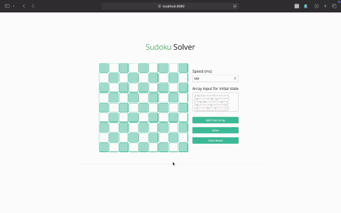

# Sodoku Solver



Visualizer (at various speeds) for backtracking algorithm used to solve a valid
sudoku board.

Lets you solve puzzles instantly, fill in the grid manually, or using an array;
and clear the board whenever you want.

## Steps to run (locally)

- **Install dependencies**

    ```bash
    npm install
    ```

- **Run dev server**

    ```bash
    npm run dev
    ```

- **Servers on <http://localhost:8080>** (Check webpack.config.js)

<br />

---

Checkout demo at: <https://garvit-exe.github.io/sudokuSolver/>

---
